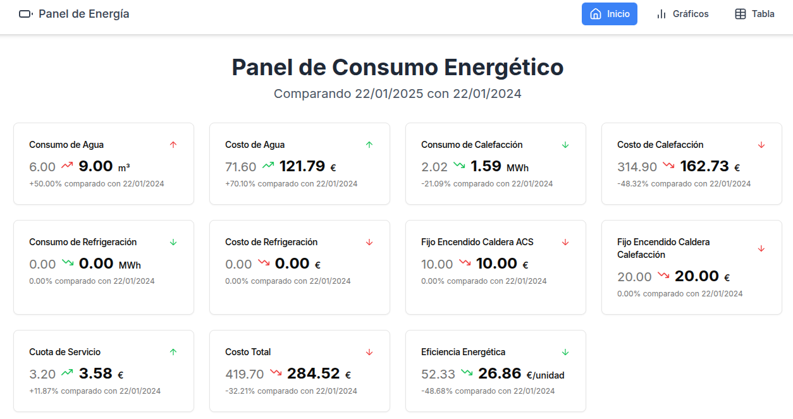
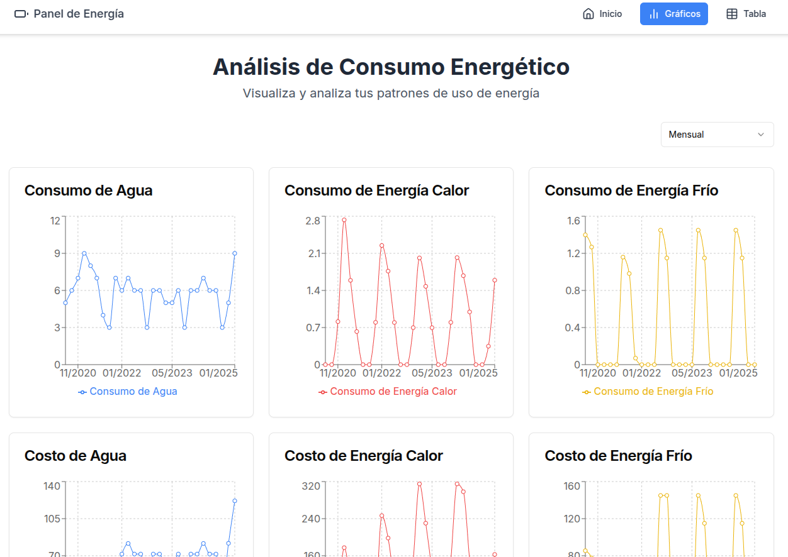
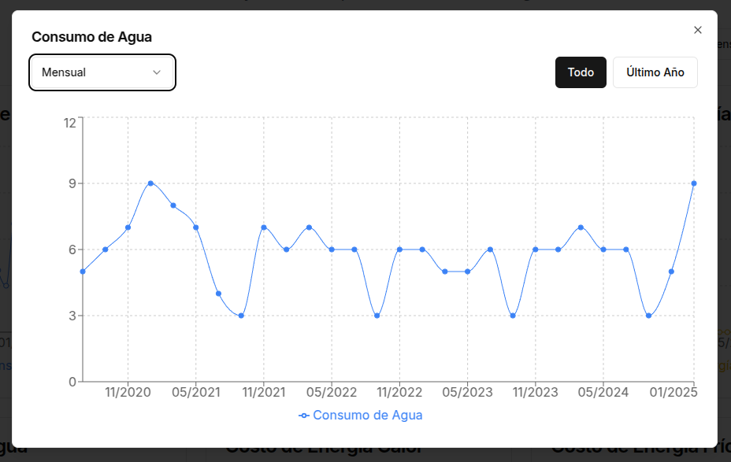
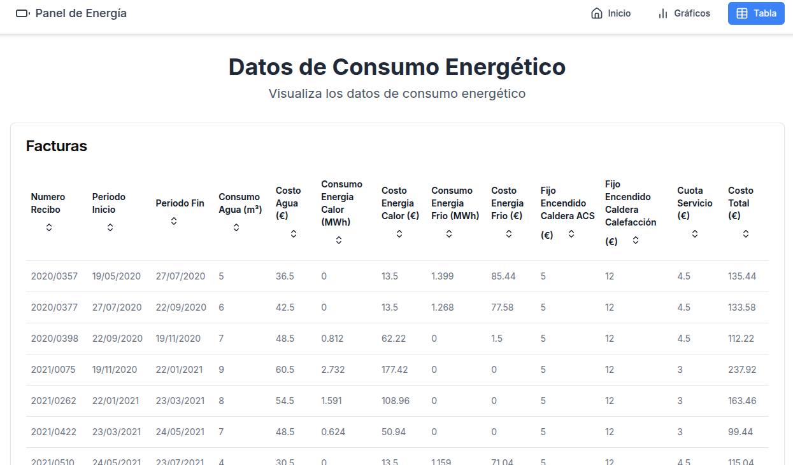

# Energy Consumption Management Panel

## Description

This project is a modern web application for managing and visualizing energy consumption data. It allows users to view, analyze, and compare water, heating, and cooling consumption data, along with their associated costs, through an intuitive interface and interactive charts.

## Features

- **Main Dashboard**: Displays a summary of the latest consumption and cost data, comparing them with previous periods.
- **Chart Visualization**: Includes interactive charts for:
    - Water, heating, and cooling consumption
    - Costs associated with each type of energy
    - Total cost distribution
    - Consumption and cost trends over time
    - Energy efficiency
- **Data Table**: Presents all data in a tabular format with sorting and pagination options.
- **Responsive Design**: Adaptable interface for both mobile and desktop devices.

## Technologies Used

- **Frontend**:
    - React.js
    - Next.js 13 (App Router)
    - TypeScript
    - Tailwind CSS
    - shadcn/ui (UI components)
    - Recharts (for charts)

- **Backend**:
    - Next.js API Routes

- **Others**:
    - ESLint for linting
    - Prettier for code formatting

## Prerequisites

- Node.js (version 14.0 or higher)
- npm (usually comes with Node.js)

## Installation

1. Clone the repository:
   ```bash
   git clone https://github.com/your-repo/energy-consumption-panel.git
   ```

2. Navigate to the project directory:
   ```bash
   cd energy-consumption-panel
   ```

3. Install dependencies:
   ```bash
   npm install
   ```

4. Start the development server:
   ```bash
   npm run dev
   ```

   The application will be available at `http://localhost:3000`.

## Deployment

To deploy the application, you can use Vercel or another hosting provider that supports Next.js.

1. Build the application:
   ```bash
   npm run build
   ```
2. Start the production server:
   ```bash
   npm start
   ```

Alternatively, you can deploy directly using Vercel:
   ```bash
   vercel
   ```

## Screenshots

### Main Dashboard


### Energy Consumption Analysis


### Detailed Water Consumption Chart


### Energy Consumption Data Table


## Contribution

Contributions are welcome! If you want to contribute:
1. Fork the repository.
2. Create a feature branch (`git checkout -b feature-branch`).
3. Commit your changes (`git commit -m 'Add new feature'`).
4. Push to the branch (`git push origin feature-branch`).
5. Open a pull request.

## License

This project is licensed under the [MIT License](LICENSE).

## Contact

For any inquiries or support, feel free to reach out via email or open an issue in the repository.

